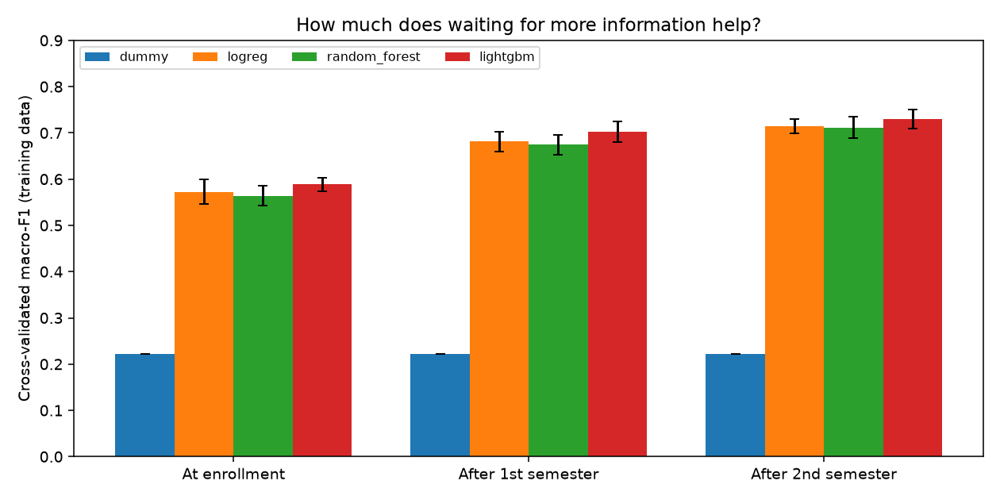
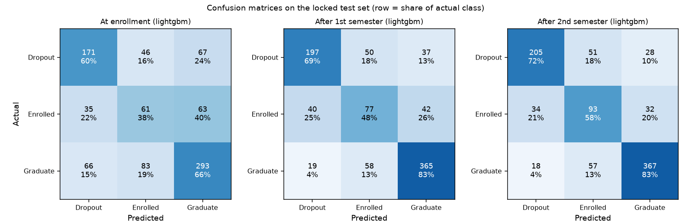
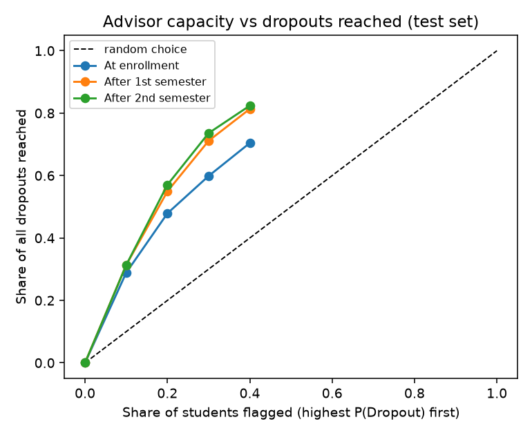

# Student Support Radar: early dropout-risk estimates

[](https://github.com/ahrifat7/student-dropout-upgrade/actions/workflows/ci.yml)

**Live demo:** [https://student-support-radar.streamlit.app/](https://dropoutradar.streamlit.app/)

A decision-support app that estimates whether a university student will **drop out**, stay **enrolled**, or **graduate**, and shows **how early** each prediction can be made. Instead of one model that quietly uses late information, it trains one model per moment (at enrollment, after semester 1, after semester 2) and measures what each extra piece of information buys.



## Results

Locked test set of 885 students, evaluated once after all choices were made. Brackets are 95% bootstrap intervals. A majority-class guess scores macro-F1 0.222.

| Prediction moment | Macro-F1 | Accuracy | Dropout recall | If advisors contact the top 20%... |
|---|---|---|---|---|
| At enrollment | 0.547 (0.514-0.580) | 59.3% | 0.60 | reach 48% of dropouts, 77% precision |
| After semester 1 | 0.667 (0.630-0.700) | 72.2% | 0.69 | reach 55% of dropouts, 88% precision |
| After semester 2 | 0.706 (0.675-0.738) | 75.1% | 0.72 | reach 57% of dropouts, 92% precision |

**What I learned (honest version)**

- The best-looking number (macro-F1 about 0.70) needs second-semester results, when many students have already left. The realistic early warning is much weaker (0.55), but still useful for ranking who to call first.
- LightGBM beat logistic regression and a random forest in cross-validation by only about 0.015-0.03, comparable to the fold-to-fold noise (and it did not win on the test set at enrollment). I kept it for per-student explanations, not because it is decisively more accurate.
- "Enrolled" is the hardest outcome; it is not a distinct kind of student.
- Dropout recall at enrollment is uneven: 0.37 for students aged 19 or younger versus 0.82-0.85 for those 25 and over, and 0.32 for scholarship holders versus 0.67 for others.
- "Tuition fees up to date" dominates the enrollment model. It may be recorded after a student stops paying, so the enrollment-stage score needs verification with the data providers.

Full write-up: [error analysis](reports/error_analysis.md) and [model card](docs/MODEL_CARD.md).

| Confusion matrices (test set) | Who gets flagged first |
|---|---|
|  |  |

## What the app does

- **Overview:** headline results and the stage comparison.
- **Predict a student:** pick a prediction moment, fill in the form, see probabilities and a SHAP explanation of the top factors.
- **Score a cohort:** upload a CSV (template provided), download scored results.
- **Model comparison, Error analysis, About and limits:** cross-validation tables, subgroups, calibration, advisor-capacity analysis, worst mistakes, model card.

## Method

1. Stratified 80/20 split with a fixed seed. The 20% test set stays locked.
2. Feature sets nested by time: enrollment, plus semester 1, plus semester 2.
3. Four models per stage (majority baseline, logistic regression, random forest, LightGBM). Hyperparameters and the final model are chosen by 5-fold cross-validation on training data only, on macro-F1.
4. Test set evaluated once, with bootstrap confidence intervals.
5. Error analysis on out-of-fold training predictions: subgroups, calibration, most-confident mistakes, TreeSHAP importance, and a hold-out-whole-cohorts check using the economic-indicator groups.
6. Deployed models are refit on all rows with the chosen hyperparameters. If the host's library versions differ from training, the app refits from saved hyperparameters instead of crashing.

## Run it

```bash
python -m venv .venv
source .venv/bin/activate          # Windows: .\.venv\Scripts\Activate.ps1
pip install -r requirements-dev.txt

python -m dropout.train            # optional: regenerates models/ and reports/ (a few minutes)
streamlit run app.py               # open the printed local URL
pytest                             # 43 tests
ruff check .                       # lint
```

Docker:

```bash
docker build -t student-support-radar .
docker run -p 8501:8501 student-support-radar
```

## Repository layout

```
app.py                  Streamlit app (6 pages)
dropout/
  config.py             paths, seeds, stage definitions
  data.py               loading, validation, splits, stage columns
  models.py             baselines + LightGBM wrapper with SHAP contributions
  evaluate.py           CV, tuning, bootstrap, slices, calibration, capacity
  explain.py            per-student and global explanations
  registry.py           save/load models, safe retrain fallback
  train.py              end-to-end training and report generation
models/                 trained artifacts + metadata.json
reports/                results, figures, subgroup tables, error_analysis.md
docs/                   MODEL_CARD.md, INTERVIEW_PREP.md
tests/                  data, models, evaluation, artifacts, app smoke tests
data/                   UCI dataset + README with citation
```

## Limitations

Single institution (Portugal), 4,424 students, no external validation. Fairness across protected groups has not been established, and the model must never be the sole basis for a decision about a student. See the [model card](docs/MODEL_CARD.md).

## Data and license

Data: Realinho, V., Vieira Martins, M., Machado, J., & Baptista, L. (2021). *Predict Students' Dropout and Academic Success* [Dataset]. UCI Machine Learning Repository. https://doi.org/10.24432/C5MC89 (CC BY 4.0). Describing paper: Realinho et al. (2022), *Data* 7(11), 146, https://doi.org/10.3390/data7110146.

Code: MIT, see [LICENSE](LICENSE).
